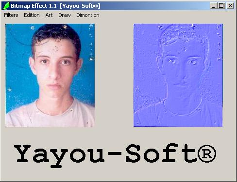

<div align="center">

## bitmap effect 1\.01


</div>

### Description

bitmap effect filters 1.01

there is 11 filters (sharpen,emboss,clibred,....)+ acceleration

it's very good
 
### More Info
 


<span>             |<span>
---                |---
**Submitted On**   |2004-06-24 20:12:30
**By**             |[yacine ait chalal](https://github.com/Planet-Source-Code/PSCIndex/blob/master/ByAuthor/yacine-ait-chalal.md)
**Level**          |Advanced
**User Rating**    |5.0 (10 globes from 2 users)
**Compatibility**  |VB 3\.0, VB 4\.0 \(16\-bit\), VB 4\.0 \(32\-bit\), VB 5\.0, VB 6\.0
**Category**       |[Graphics](https://github.com/Planet-Source-Code/PSCIndex/blob/master/ByCategory/graphics__1-46.md)
**World**          |[Visual Basic](https://github.com/Planet-Source-Code/PSCIndex/blob/master/ByWorld/visual-basic.md)
**Archive File**   |[bitmap\_eff176570742004\.zip](https://github.com/Planet-Source-Code/yacine-ait-chalal-bitmap-effect-1-01__1-54750/archive/master.zip)

### API Declarations

```
GetDibits
SetDibits
```


